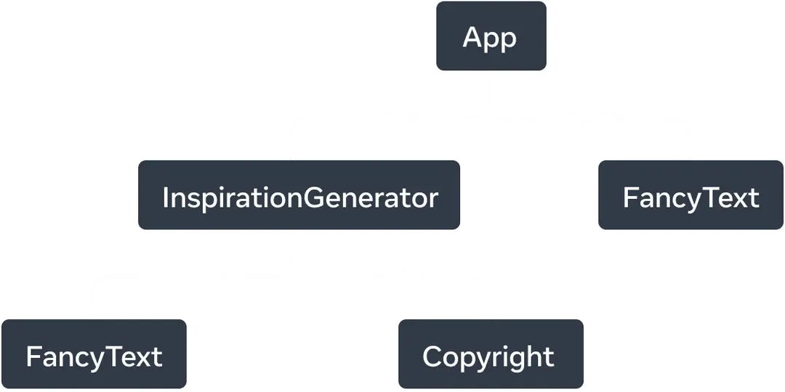

# Exercice : React maison

Une application React est faite entièrement de composants, lesquels sont
en fait que des fonctions qui retournent un élément HTML. React se
représente une interface graphique comme un arbre enraciné où chaque
nœud est une fonction. 



La racine de l'arbre (par convention, le composant `App`) est la
première fonction appelée au moment d'afficher l'interface.
Techniquement, le composant racine est d'ailleurs le seul qui est appelé
directement par React. Si vous ouvrez le fichier `main.ts` de votre
application, vous verrez que `<App />` est donné comme argument à la
méthode `render`. 

```tsx
createRoot(document.getElementById('root')!).render(
    <StrictMode>
        <App />
    </StrictMode>,
)
```

Les autres composants sont plutôt appelés par leur propre composant
parent. Par exemple, dans le graphe ci-dessus, les composants
`FancyText` et `Copyright` sont appelés par le composant
`InspirationGenerator`, lequel est appelé à son tour par `App`.

## Étape 1

Tentons d'implémenter nous même l'interface de programmation de React
tel qu'il est décrit ci-dessus. Pour cette première étape, on se
concentrera sur l'affichage des composants.

Dans un fichier `react.ts`, créez une fonction `createRoot` qui prend
comme seul argument un élément HTML. C'est dans celui-ci que nous
insérerons notre composant racine. 

```ts
// react.ts

export function createRoot(/* TODO */) {
    /* TODO */
}
```

Nous utiliserons `createRoot` dans notre propre fichier `main.ts` :

```ts
// main.ts

import { createRoot } from "./react.ts";

createRoot(document.body);
```

La fonction `createRoot` doit retourner un objet ayant une méthode
`render`. Cette méthode prendra comme argument la fonction qui
représente le composant racine de notre application (`App`).

```ts
// main.ts

import { createRoot } from "./react.ts";
import App from "App.ts";

createRoot(document.body).render(App);
```

Notre implémentation de React n'utilisera pas JSX. Dans notre cas, un
composant sera une fonction qui retourne simplement un élément HTML.

Voici un exemple de ce à quoi pourrait ressembler un composant racine :

```ts
// App.ts

export default function App(): HTMLElement {
    const main = document.createElement("main");
    const h1 = document.createElement("h1");
    h1.textContent("Bonjour le monde !");
    main.append(h1);
    return main;
}
```

La tâche de la fonction `render` est d'appeler la fonction qui lui est
passée comme argument (`App`, par exemple), et d'insérer l'élément HTML
retourné par cette fonction dans l'élément donné à `createRoot`.

Si votre implémentation est correcte, une fois que vous aurez lié
`main.js` à un document HTML, vous devriez voir apparaître le contenu de
`App` dans votre navigateur. 

Essayez ensuite de placer le `<h1>` dans son propre composant nommé
`Header`, puis insérez `Header` dans `App`. Rappelez-vous : un composant
est juste une fonction qui retourne un élément HTML.

Voilà, vous avez réussi à implémenter React !
